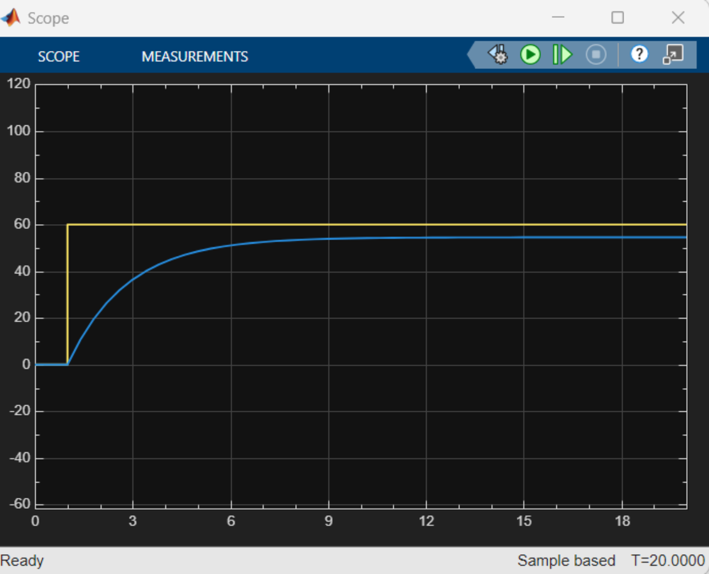
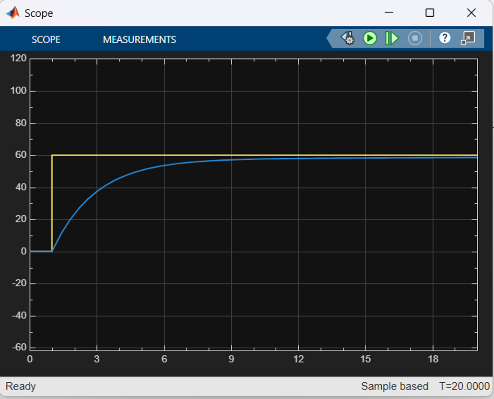

# Cruise Control System: PID Disturbance Rejection 🚗
**Tool:** MATLAB / Simulink | **Domain:** Control Theory

## 📌 Project Overview
This project simulates an automatic cruise control system. [cite_start]The goal is to maintain a vehicle speed of **60 km/h** despite external disturbances (such as road hills or friction changes)[cite: 40, 41].

## ⚙️ The Challenge
A standard **P-Controller** failed to maintain the target speed.
- **Problem:** Significant steady-state error.
- [cite_start]**Result:** When a disturbance occurred (e.g., a hill), the speed dropped and never recovered to 60 km/h[cite: 46, 51].

## 🛠️ The Solution (PI Controller)
I implemented a **Proportional-Integral (PI) Controller** to eliminate the error.
- [cite_start]**Integral Action:** Continuously sums the error over time to drive the steady-state error to zero[cite: 67].
- [cite_start]**Result:** The system effectively rejects disturbances and maintains the target speed of 60 km/h[cite: 58].

## 📸 System Architecture

## 📈 Simulation Results (PI Response)
*The graph below shows the PI controller achieving the target speed (Yellow Line) with Zero Steady-State Error.*

## 📂 Files Included
- `Cruise_Control.slx`: The complete Simulink model.
- `Presentation.pptx`: Detailed project report and analysis.
